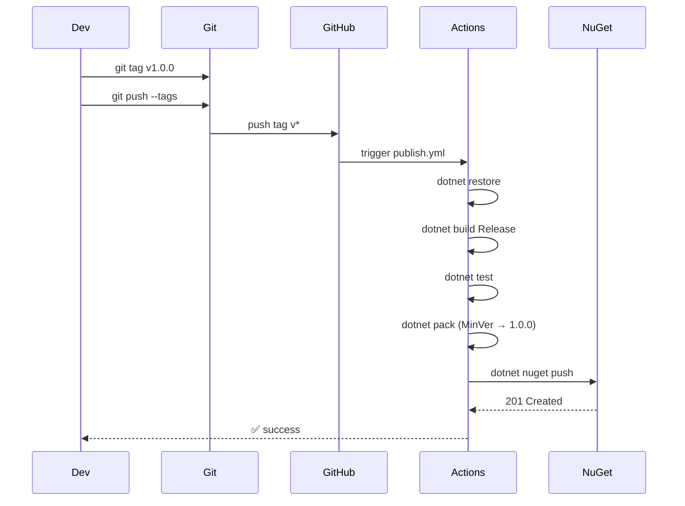

# Pack & Publish Plan — NuGet + GitHub Actions

## Objetivo

Publicar os projetos **core** (`Abstractions`, `EntityFrameworkCore`, `Generator`) como pacotes NuGet sempre que uma tag de versão (`v1.0.0`, `v1.1.0`, etc.) for criada no repositório.

O **SoftDelete** fica de fora por enquanto — será publicado em outra iteração.

---

## Pacotes que serão gerados

| Projeto | PackageId | Tipo |
|---------|-----------|------|
| `AuditLog.Abstractions` | `AuditLog.Abstractions` | lib |
| `AuditLog.EntityFrameworkCore` | `AuditLog.EntityFrameworkCore` | lib |
| `AuditLog.Generator` | `AuditLog.Generator` | analyzer (Roslyn) |
| `AuditLog.Generator.Shared` | _(não publicado — linked source apenas)_ | — |

`AuditLog.EntityFrameworkCore` já depende de `AuditLog.Abstractions` via `ProjectReference`.
`AuditLog.Generator` é independente (netstandard2.0, sem ref a projetos runtime).

---

## Arquivos a criar/modificar

| # | Arquivo | Ação |
|---|---------|------|
| 1 | `Directory.Build.props` | **Criar** — versão, authors, license, repo info |
| 2 | `src/AuditLog.Abstractions/AuditLog.Abstractions.csproj` | **Modificar** — adicionar metadados NuGet |
| 3 | `src/AuditLog.EntityFrameworkCore/AuditLog.EntityFrameworkCore.csproj` | **Modificar** — adicionar metadados NuGet |
| 4 | `src/AuditLog.Generator/AuditLog.Generator.csproj` | **Modificar** — adicionar metadados NuGet |
| 5 | `.github/workflows/publish.yml` | **Criar** — workflow CI/CD |
| 6 | `pack.sh` | **Criar** — script de pack local |
| 7 | `.gitignore` | **Modificar** — ignorar `artifacts/`, `*.nupkg` |

---

## 1. Directory.Build.props

Criado na raiz da solution. Define valores padrão para TODOS os projetos.

```xml
<Project>
  <PropertyGroup>
    <Authors>AuditLog</Authors>
    <Company>AuditLog</Company>
    <Copyright>Copyright (c) AuditLog</Copyright>
    <RepositoryType>git</RepositoryType>
    <RepositoryUrl>https://github.com/samueldias/audit_log</RepositoryUrl>
    <PackageProjectUrl>https://github.com/samueldias/audit_log</PackageProjectUrl>
    <PackageLicenseExpression>MIT</PackageLicenseExpression>
    <PackageTags>audit;ef-core;entity-framework;source-generator</PackageTags>
    <PackageReadmeFile>README.md</PackageReadmeFile>
    <IncludeSymbols>true</IncludeSymbols>
    <SymbolPackageFormat>snupkg</SymbolPackageFormat>
    <PublishRepositoryUrl>true</PublishRepositoryUrl>
    <EmbedUntrackedSources>true</EmbedUntrackedSources>
  </PropertyGroup>

  <PropertyGroup>
    <MinVerSkip Condition="$(Configuration) == 'Debug'">true</MinVerSkip>
  </PropertyGroup>

  <ItemGroup>
    <PackageReference Include="MinVer" PrivateAssets="all" />
  </ItemGroup>
</Project>
```

**MinVer** é usado para inferir a versão do NuGet a partir de tags git. Ex:
- Tag `v1.0.0` → versão `1.0.0`
- Tag `v1.0.0-beta1` → versão `1.0.0-beta.1`
- Sem tag → `0.0.0-alpha.{commitCount}`

---

## 2. Metadados nos .csproj

### `AuditLog.Abstractions.csproj`

```xml
<Project Sdk="Microsoft.NET.Sdk">
  <PropertyGroup>
    <TargetFramework>net10.0</TargetFramework>
    <ImplicitUsings>enable</ImplicitUsings>
    <Nullable>enable</Nullable>
    <RootNamespace>AuditLog.Abstractions</RootNamespace>
    <Description>Abstractions and contracts for AuditLog — AuditConfigurator<T>, IAuditDescriptor, AuditRegistry, and builders.</Description>
    <PackageId>AuditLog.Abstractions</PackageId>
  </PropertyGroup>
  <ItemGroup>
    <PackageReference Include="Microsoft.EntityFrameworkCore" />
  </ItemGroup>
</Project>
```

### `AuditLog.EntityFrameworkCore.csproj`

```xml
<Project Sdk="Microsoft.NET.Sdk">
  <PropertyGroup>
    <TargetFramework>net10.0</TargetFramework>
    <ImplicitUsings>enable</ImplicitUsings>
    <Nullable>enable</Nullable>
    <RootNamespace>AuditLog.EntityFrameworkCore</RootNamespace>
    <Description>EF Core integration for AuditLog — AuditSaveInterceptor, service collection extensions, and model builder hooks.</Description>
    <PackageId>AuditLog.EntityFrameworkCore</PackageId>
  </PropertyGroup>
  <ItemGroup>
    <PackageReference Include="Microsoft.EntityFrameworkCore.Relational" />
  </ItemGroup>
  <ItemGroup>
    <ProjectReference Include="..\AuditLog.Abstractions\AuditLog.Abstractions.csproj" />
  </ItemGroup>
</Project>
```

### `AuditLog.Generator.csproj`

Adicionar ao `PropertyGroup` existente:

```xml
<Description>Roslyn source generator for AuditLog — generates *AuditLog classes, entity maps, descriptors, and DI extensions from AuditConfigurator<T> declarations.</Description>
<PackageId>AuditLog.Generator</PackageId>
```

---

## 3. Pack script (`pack.sh`)

Script bash que:
1. Limpa `artifacts/`
2. Restaura
3. Builda em Release
4. Empacota todos os projetos core
5. Gera os `.nupkg` em `artifacts/packages/`

```bash
#!/usr/bin/env bash
set -euo pipefail

ROOT_DIR="$(cd "$(dirname "$0")" && pwd)"
ARTIFACTS_DIR="$ROOT_DIR/artifacts"
PACKAGES_DIR="$ARTIFACTS_DIR/packages"
CONFIGURATION="${CONFIGURATION:-Release}"

rm -rf "$ARTIFACTS_DIR"
mkdir -p "$PACKAGES_DIR"

echo "==> Restoring..."
dotnet restore "$ROOT_DIR/AuditLog.slnx"

echo "==> Building..."
dotnet build "$ROOT_DIR/AuditLog.slnx" \
  --configuration "$CONFIGURATION" \
  --no-restore

echo "==> Packing core projects..."
CORE_PROJECTS=(
  "src/AuditLog.Abstractions/AuditLog.Abstractions.csproj"
  "src/AuditLog.EntityFrameworkCore/AuditLog.EntityFrameworkCore.csproj"
  "src/AuditLog.Generator/AuditLog.Generator.csproj"
)

for project in "${CORE_PROJECTS[@]}"; do
  echo "    Packing $project..."
  dotnet pack "$ROOT_DIR/$project" \
    --configuration "$CONFIGURATION" \
    --no-build \
    --output "$PACKAGES_DIR"
done

echo ""
echo "==> Packages generated in $PACKAGES_DIR:"
ls -lh "$PACKAGES_DIR"/*.nupkg 2>/dev/null || echo "    (no packages found)"
```

---

## 4. GitHub Action (`publish.yml`)

Workflow que:
1. Dispara em push de tags `v*`
2. Builda e testa
3. Gera os pacotes
4. Publica no NuGet.org (ou outro feed via `NUGET_SOURCE`)

```yaml
name: Publish to NuGet

on:
  push:
    tags:
      - 'v*'

jobs:
  publish:
    runs-on: ubuntu-latest
    steps:
      - uses: actions/checkout@v4
        with:
          fetch-depth: 0

      - uses: actions/setup-dotnet@v4
        with:
          dotnet-version: 10.0.x

      - name: Restore
        run: dotnet restore

      - name: Build
        run: dotnet build --configuration Release --no-restore

      - name: Test
        run: dotnet test --configuration Release --no-build

      - name: Pack core projects
        run: |
          dotnet pack src/AuditLog.Abstractions/AuditLog.Abstractions.csproj \
            --configuration Release --no-build \
            --output "${{ runner.temp }}/packages"

          dotnet pack src/AuditLog.EntityFrameworkCore/AuditLog.EntityFrameworkCore.csproj \
            --configuration Release --no-build \
            --output "${{ runner.temp }}/packages"

          dotnet pack src/AuditLog.Generator/AuditLog.Generator.csproj \
            --configuration Release --no-build \
            --output "${{ runner.temp }}/packages"

      - name: Push to NuGet
        run: |
          dotnet nuget push "${{ runner.temp }}/packages/*.nupkg" \
            --source "${{ secrets.NUGET_SOURCE || 'https://api.nuget.org/v3/index.json' }}" \
            --api-key "${{ secrets.NUGET_API_KEY }}" \
            --skip-duplicate
```

Variáveis de segredo necessárias no repositório GitHub:

| Segredo | Descrição |
|---------|-----------|
| `NUGET_API_KEY` | API key com permissão de push no feed |
| `NUGET_SOURCE` | _(opcional)_ URL do feed, default nuget.org |

---

## 5. Dependência: MinVer

Adicionar `MinVer` como package reference nos csproj core (já incluso via `Directory.Build.props`).

O MinVer infere a versão do NuGet a partir da tag git mais próxima. Quando não há tag, gera `0.0.0-alpha.{commits}`. Quando há tag `v1.0.0`, gera `1.0.0`.

---

## 6. .gitignore

Adicionar ao final:
```
artifacts/
*.nupkg
```

---

## Resumo de execução


